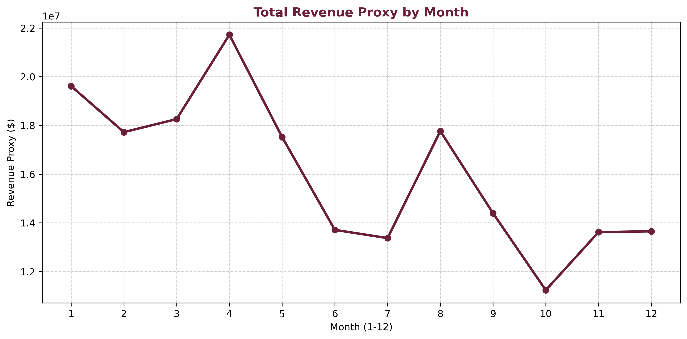
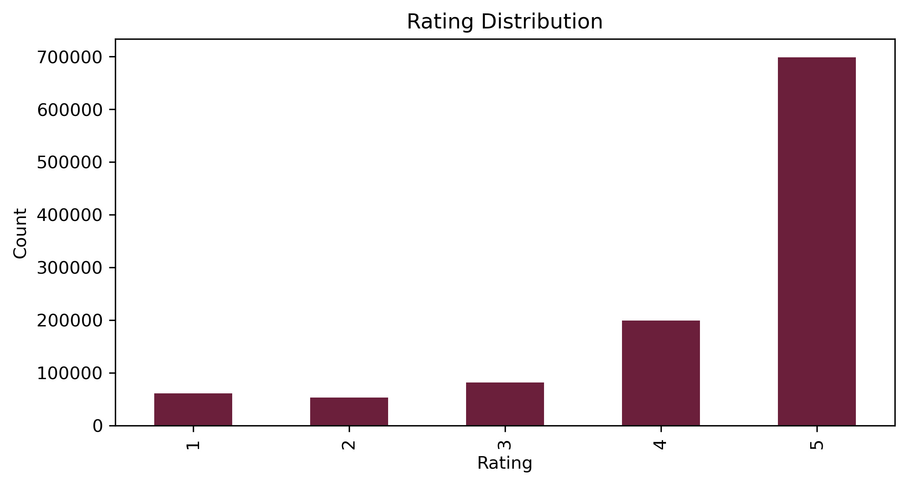
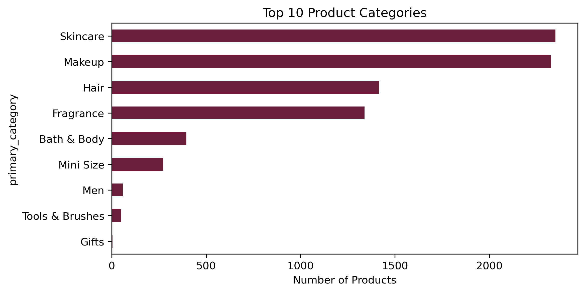
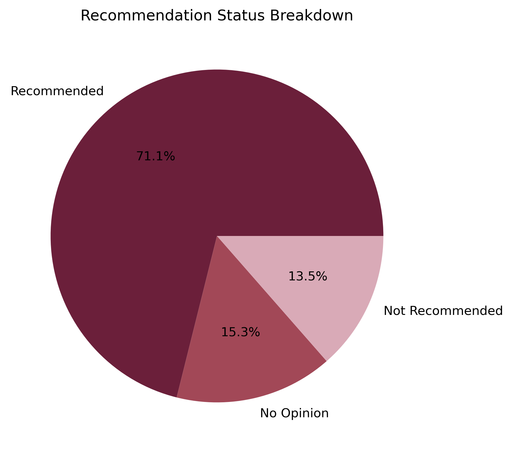

# Visual Assets & Exploratory Data Visualizations

This directory contains all exported dashboard pages, exploratory chart visualizations, and visual assets used throughout the repository documentation and executive reports.

---

## 1. Power BI Executive Dashboard Suite

| File Name | Dashboard Page | Key Business Insight Highlighted |
| :--- | :--- | :--- |
| `Executive Overview.png` | **Page 1: Executive Overview** | High-level portfolio KPIs ($192.54M Revenue Proxy, 1.09M Reviews), Sub-Category revenue distribution, and Q1–Q4 seasonal trends. |
| `Brand Dynamics & Assortment.png` | **Page 2: Brand Dynamics & Assortment** | Brand Pareto curve (Top 10 brands driving 40.89% / $78.74M), price tier distribution, and catalog pricing elasticity. |
| `Product Attention & Quality.png` | **Page 3: Product Attention & Quality** | Granular monitoring of 44 Attention SKUs representing $6.27M in revenue at risk, customer exposure volume, and out-of-stock items. |

---

## 2. Exploratory Data Visualizations

| File Name | Description | Key Insight Highlighted |
| :--- | :--- | :--- |
| `monthly_revenue_proxy_trend.png` | Historical monthly revenue proxy & volume trend | Identifies seasonal quarterly surges and post-holiday customer demand cycles. |
| `rating_distribution.png` | Distribution of customer review ratings (1–5 Stars) | Illustrates positive sentiment skew with a 4.30 catalog average baseline rating. |
| `top_10_product_categories.png` | Top catalog sub-categories ranked by revenue & volume | Highlights leading revenue concentration across Moisturizers, Treatments, and Cleansers. |
| `recommendation_status_breakdown.png` | Proportion of customer product recommendations | Quantifies the 71.10% baseline customer advocacy across verified review samples. |

---

## 3. Dashboard Previews

### Page 1: Executive Overview

### Page 2: Brand Dynamics & Assortment

### Page 3: Product Attention & Quality

---

## 4. Exploratory Analysis Previews

### Monthly Revenue Proxy Trend

### Rating Distribution

### Top 10 Product Categories

### Recommendation Status Breakdown

